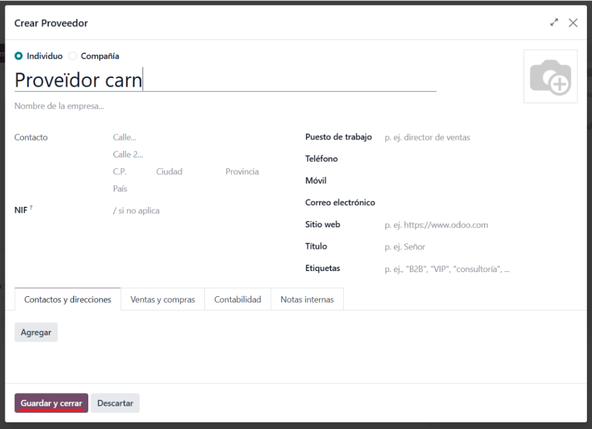
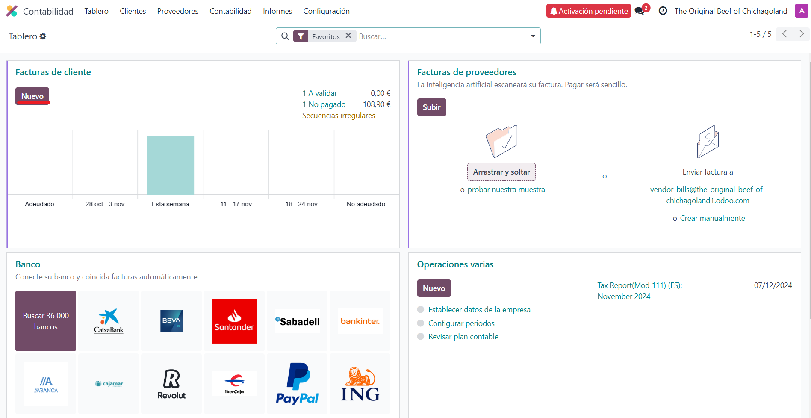

# GRUP_A_SGE
<h1>Compras</h1>
<h3>En este módulo podemos gestionar las compras de stock a los proveedores</h3>

Creamos una solicitud de presupuesto

Seleccionamos la lista de proveedores

Ampliamos la lista

Creamos un nuevo proveedor y añadimos su respectiva información

Para añadir productos, ponemos el nombre del producto y si no existe lo creamos

Pulsamos el botón de enlace interno y editamos su información (precio de venta, coste, etc)

Con todo esto, cuando esten todos los productos confirmamos el pedido

Una vez resuelta la solicitud podemos enviar el pedido al proveedor o crear una factura

<h1>Costes</h1>
<h3>Este modulo ayuda a gestionar e identificar los pagos</h3>

Creamos una nueva factura

Añadimos y/o creamos la información del cliente

Añadimos los productos anteriormente creados y guardamos la cantidad de este

Por ultimo creamos el pago para guardar la factura en proceso de pago

# GRUP_A_SGE

MÒDUL DE VENTAS

Primer de tot haurem de crear un pressupost per l’article que volem vendre, acte seguit seleccionar el client al que ho volem vendre, en el meu cas seleccionaré a Francisco

Després agregarem el producte a vendre, que serà un tomahawk bañado en oro i tindrà un preu unitari de 950 / uni. .

Com podem veure ja tenim tot creat amb preu unitari, l’iva inclòs (sempre), la quantitat que vol el client i l’import sense el iva (importantíssim).

Una vegada tot creat confirmarem la venta, en la captura on es mostra la fletxa és on estarà el botó de confirmar venta i on les línies blanques és la diferencia entre el preu sense IVA i el preu amb.

MÒDUL CALENDARI
Primerament entrem al mòdul de calendari en ODOO.

Una vegada dins li donarem a crear una reunió.

A continuació, posarem l’assumpte de la reunió (en aquest cas és un menjar de negoci), indicarem el dia i l’hora d’inici de la reunió juntament amb la final també. Després la ubicació d’on serà aquesta reunió, indicar la privacitat de l’organitzador i indicar qui pot accedir a la reunió. Per acabar, seleccionar la via per a la qual s’enviarà el missatge per venir a la reunió.

Quan seleccionem l’apartat de SMS ens apareix aquest sector per omplir-ho amb un missatge. Una vegada omplert li doneu a “enviar ahora”.

Després d’enviar-ho haurem omplert el “formulari”, així que podem donar-li a enviar.

# GRUP_A_SGE

Per començar, anem al cercador d'aplicacions d'Odoo, cercarem l'apartat "Empleats" i l'instal·larem.

--------------------------------------------------------------------------------------
Després, ens dirigirem a l'apartat d'Odoo on tenim totes les nostres aplicacions instal·lades i anirem a l'apartat "Empleats".

--------------------------------------------------------------------------------------
Una vegada dins "Empleats", cercarem el botó "Nou" per crear el perfil d'un empleat.

--------------------------------------------------------------------------------------
En crear un nou perfil, omplirem les dades del nostre empleat amb el nom, correu electrònic, número de telèfon, qualsevol etiqueta si és necessari, el gerent i el mentor d’aquest... També podrem incloure-hi el seu currículum i afegir habilitats.

--------------------------------------------------------------------------------------
Ara veurem com instal·lar i fer servir l'aplicació "Esdeveniments".

Repetim els passos de l'exercici anterior: anem al cercador i escrivim "Esdeveniments". Una vegada trobat, fem clic a "Instal·lar".

--------------------------------------------------------------------------------------
Un cop dins, anirem al nostre panell d'aplicacions i, un altre cop, cercarem "Esdeveniments".

--------------------------------------------------------------------------------------
Una vegada dins l’aplicació, farem clic a "Nou" per crear un nou esdeveniment.

--------------------------------------------------------------------------------------
Omplirem totes les dades, com la data, la zona horària, l'idioma, etiquetes, organitzador... També tenim apartats per limitar les inscripcions, entre altres.

Per altra banda, podem crear entrades per a l'esdeveniment a la part inferior, introduint-hi dades com el preu, el màxim de vendes, quan acaben les vendes d'aquestes...

--------------------------------------------------------------------------------------
Ja el tenim creat i el podem visualitzar dins el menú de l'aplicació "Esdeveniments".

# GRUP_A_SGE
<h1>Puntos de venta</h1>
<h3>Cuando hablamos de punto de venta, nos referimos a la sucursal o establecimiento físico de un negocio, ya sea un restaurante, un bar o una tienda de regalos.</h3>

Escogemos el tipo de negocio que tenemos; en nuestro caso, un restaurante.

Iniciamos una sesión con nuestro restaurante.

En este mapa de nuestro restaurante, podemos seleccionar cualquiera de las mesas disponibles para hacer un pedido.

Seleccionamos los productos consumidos por el cliente.

Los productos se añadirán a la cuenta conforme se vayan seleccionando, ajustando el precio total del pedido.

Al terminar de añadir productos, hacemos clic en el botón de pago.

Elegimos el método de pago.

Hacemos clic en el botón de validar.

Se generará una factura del pedido que acabamos de realizar, y podremos imprimirla si lo deseamos.

A continuación, cerraremos la caja.

Antes de cerrar la caja, se nos mostrarán todos los detalles de los pedidos realizados.

Podemos consultar todas las sesiones de nuestros puntos de venta en 'Pagos > Sesiones'.

<h1>Planificación</h1>
<h3>En el módulo de planificación, podremos asignar turnos y tareas a los empleados del restaurante.</h3>
 
Para crear un nuevo turno, hacemos clic en el botón 'Nuevo'.

 

Introducimos el nombre del trabajador al que deseamos destinar el turno.

 
 
Introducimos el rol que desempeñará en ese turno.

 
 
A continuación, asignaremos la fecha de inicio y fin del turno, así como las horas que se emplearán en su realización.

  
  
Cuando hayamos completado toda la información necesaria, haremos clic en el botón 'Guardar'.

  
  
 
Si hacemos clic en el botón 'Publicar', nuestro empleado será notificado de su nuevo horario a través de correo electrónico.

 
