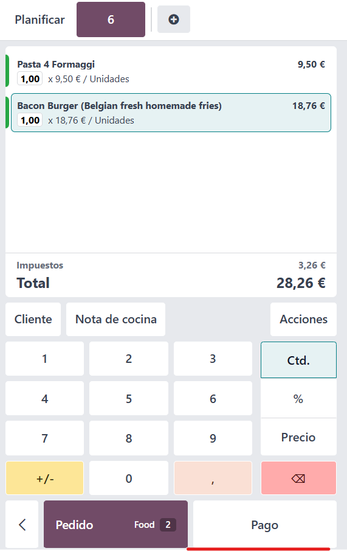
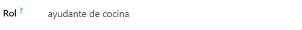
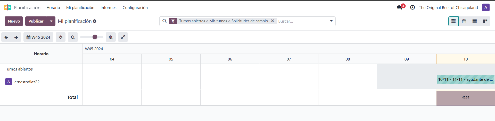

# GRUP_A_SGE
<h1>Puntos de venta</h1>
<h3>Cuando hablamos de punto de venta, nos referimos a la sucursal o establecimiento físico de un negocio, ya sea un restaurante, un bar o una tienda de regalos.</h3>

Escogemos el tipo de negocio que tenemos; en nuestro caso, un restaurante.

Iniciamos una sesión con nuestro restaurante.

En este mapa de nuestro restaurante, podemos seleccionar cualquiera de las mesas disponibles para hacer un pedido.

Seleccionamos los productos consumidos por el cliente.

Los productos se añadirán a la cuenta conforme se vayan seleccionando, ajustando el precio total del pedido.

Al terminar de añadir productos, hacemos clic en el botón de pago.

Elegimos el método de pago.

Hacemos clic en el botón de validar.

Se generará una factura del pedido que acabamos de realizar, y podremos imprimirla si lo deseamos.

A continuación, cerraremos la caja.

Antes de cerrar la caja, se nos mostrarán todos los detalles de los pedidos realizados.

Podemos consultar todas las sesiones de nuestros puntos de venta en 'Pagos > Sesiones'.

<h1>Planificación</h1>
<h3>En el módulo de planificación, podremos asignar turnos y tareas a los empleados del restaurante.</h3>
 
Para crear un nuevo turno, hacemos clic en el botón 'Nuevo'.

 

Introducimos el nombre del trabajador al que deseamos destinar el turno.

 
 
Introducimos el rol que desempeñará en ese turno.

 
 
A continuación, asignaremos la fecha de inicio y fin del turno, así como las horas que se emplearán en su realización.

  
  
Cuando hayamos completado toda la información necesaria, haremos clic en el botón 'Guardar'.

  
  
 
Si hacemos clic en el botón 'Publicar', nuestro empleado será notificado de su nuevo horario a través de correo electrónico.

 

 
 

